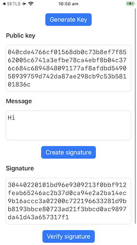
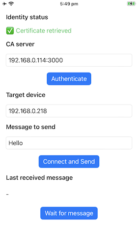

# Secure Enclave iOS Demos

This repo has two sample iOS apps **SESigning** and **SETLS** that use the Secure Enclave to generate protected private keys and sign things. This code accompanies a talk I am presenting at [/dev/world](https://devworld.au) 2025 called _Protect your keys with the Secure Enclave_. (Amusingly, this is almost the same title as one of [Apple's own documentation pages](https://developer.apple.com/documentation/security/protecting-keys-with-the-secure-enclave)—perhaps my subconscious liked the phrase.)

This is demo code that skips or simplifies error handling in many cases to reduce verbosity. Please use it as a reference, not for copy-paste.

## SESigning

**SESigning** is a simple UI for generating and verifying signatures, with all the binary messages shown in editable hex. You can check that the signature verifies and see how it fails if you edit the message, signature, or public key. `EnclaveOperations.swift` is a good reference for these basic cryptographic operations.

## SETLS

**SETLS** is a more advanced example designed to run on two iPhones plus a regular computer. Once they obtain certificates, the two iPhones can establish a direct peer-to-peer connection secured with mutual TLS. What's interesting about this is that the private key used by TLS is protected by the Secure Enclave. This works by having the extra computer acts as a Certificate Authority (CA), which will receive CSRs from the iPhones and sign leaf certificates that they will mutually trust.

For extra fun, the keys generated in this app are configured to require biometric authentication so you have to use Touch ID or Face ID to authorise the incoming and outgoing connections.

### se_tls_rust

A Rust library that backs **SETLS** Swift code. This generates the CSR, handles the request to the CA, and implements the TLS using the Rust crate `rustls`. It relies on Swift to create the key and sign things on demand. The XCode project is configured to build this Rust code automatically and integrate it using [swift-bridge](https://crates.io/crates/swift-bridge).

`signer.rs` contains the main integration point where we configure the `rcgen` and `rustls` libraries to use our custom signing logic.

### ca_service

The Certificate Authority service that the SETLS iOS apps depend on. This is a small HTTP server written in Rust.
